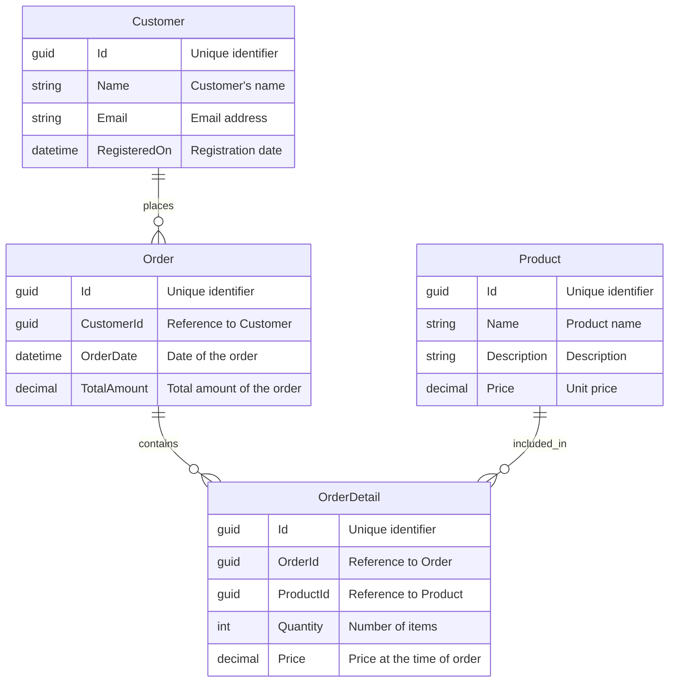

# Technical Assignment: E-Commerce Backend Services

## Overview

This assignment will guide you through creating a backend service for an e-commerce system using .NET Core and Entity Framework Core. You will develop a set of APIs that manage customers, orders, order details, and products. This project will help you understand how to structure applications in .NET Core, implement CRUD operations, and separate concerns using service layers.

## Objectives

- Implement CRUD operations for each entity.
- Understand and apply best practices in EF Core.
- Develop an understanding of service-oriented architecture in .NET Core.
- Gain experience with data modeling and database management.

## Tools and Technologies

- .NET Core 8
- Entity Framework Core
- Postgresql or any compatible database
- Visual Studio or VS Code

## Entities

### Customer

- Id (GUID)
- Name (string)
- Email (string)
- RegisteredOn (DateTime)

### Product

- Id (GUID)
- Name (string)
- Description (string)
- Price (decimal)

### Order

- Id (GUID)
- CustomerId (GUID) [Foreign Key]
- OrderDate (DateTime)
- TotalAmount (decimal) [Calculated field]

### OrderDetail

- Id (GUID)
- OrderId (GUID) [Foreign Key]
- ProductId (GUID) [Foreign Key]
- Quantity (int)
- Price (decimal) [Should be fetched from the product table at the time of order]

### Entities in Mermaid format

## Services

Each service layer should contain business logic for managing its respective entity.

### OrderService

- PlaceOrder: Method to create an order and its details.
- CancelOrder: Method to cancel an existing order.
- UpdateOrder: Method to update the order details.
- GetOrder: Method to retrieve order details.

### CustomerService

- AddCustomer: Method to add a new customer.
- UpdateCustomer: Method to update existing customer information.
- DeleteCustomer: Method to delete a customer.
- GetCustomer: Method to retrieve customer details.

### ProductService

- AddProduct: Method to add a new product.
- UpdateProduct: Method to update product details.
- DeleteProduct: Method to delete a product.
- GetProduct: Method to retrieve product details.

## Requirements

### Database Setup

- Use EF Core migrations to set up the database schema.
- Seed the database with initial data for testing.

### API Development

- Develop an API for each CRUD operation for each entity.

### Exception Handling

- Implement global exception handling.

### Logging

- Use built-in logging frameworks to log important information and errors.

### Validation

- Validate incoming data before processing CRUD operations.

### Documentation

- Document your APIs using Swagger.

## Submission Guidelines

- Submit the project in github file containing all the source code.
- Include a README.md file with setup instructions and a brief description of each service method.

## Evaluation Criteria

- Code organization and quality.
- Correct implementation of CRUD operations and service layers.
- Effective use of Entity Framework Core features.
- Handling of edge cases and potential errors.
